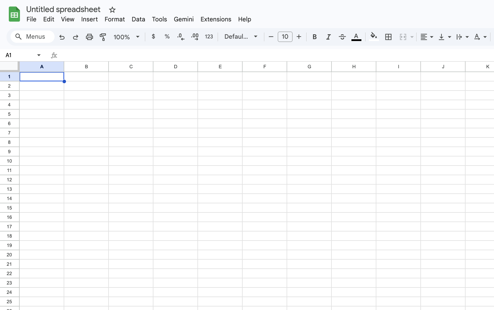
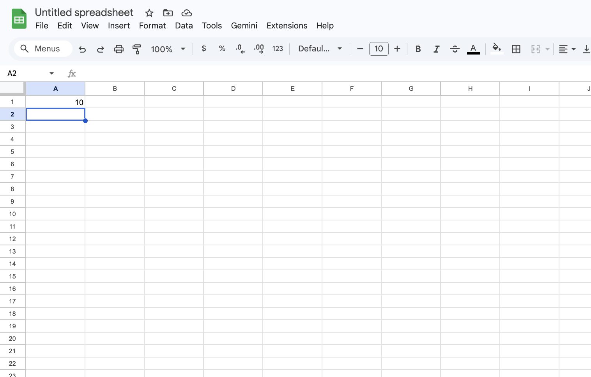
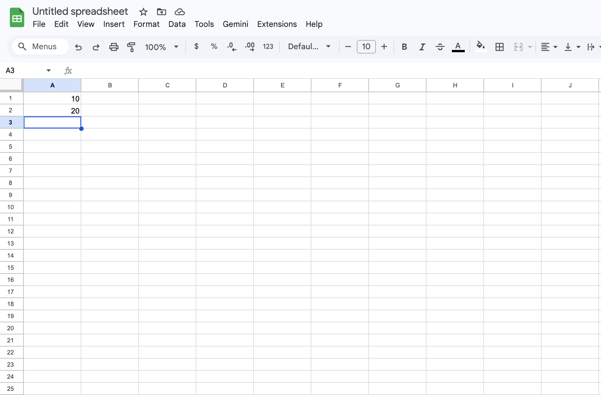
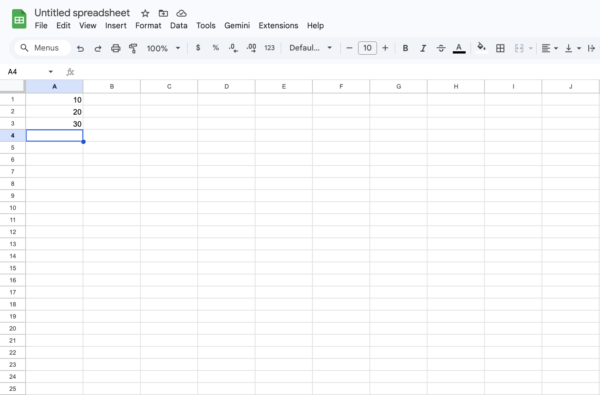
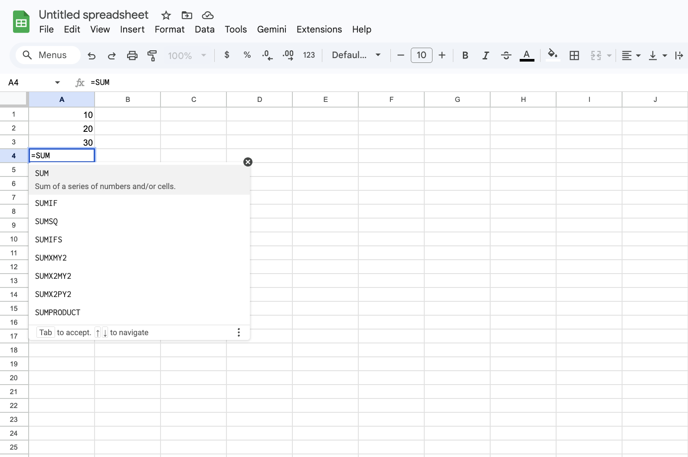
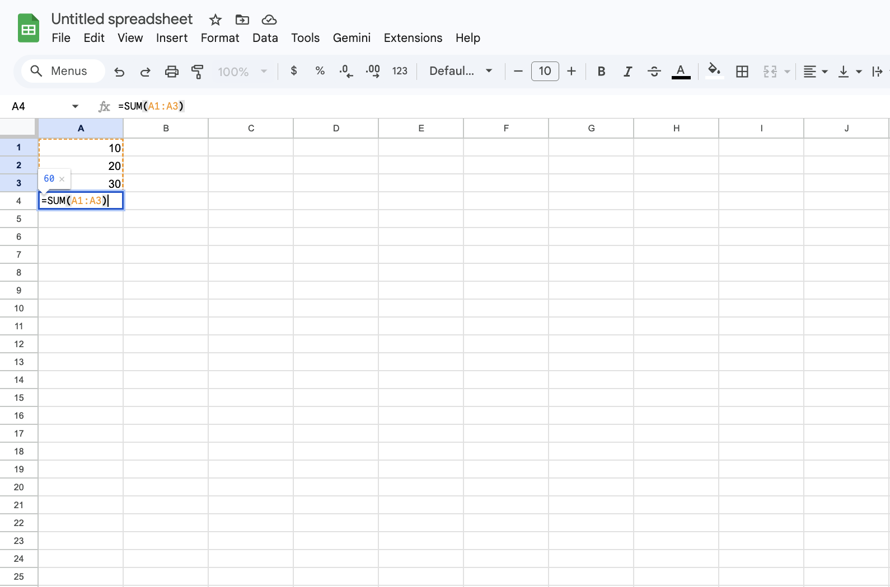
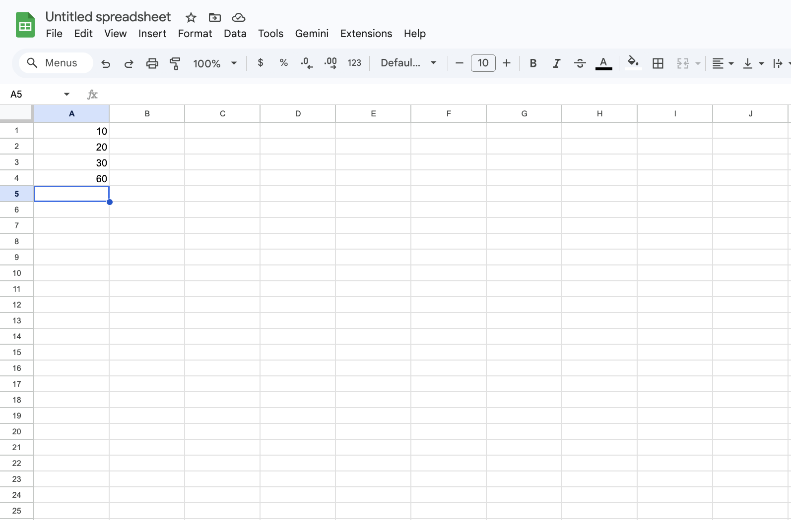

# Task 1: Creating a Basic Automatic Sum

## Overview

In Google Sheets, formulas allow you to perform calculations automatically. One of the most common formulas is `SUM()`, which adds a group of numbers together. Instead of calculating totals manually, you can let Google Sheets update the result instantly whenever the data changes.

This concept is foundational because every spreadsheet task builds on the idea of using formulas to automate work.

## What is a Formula ?

A formula in Google Sheets is an expression that begins with an equals sign (`=`) and instructs the spreadsheet to compute a value.

The most common function is the `SUM()` function which accepts a range of cells and returns their total.

For example:

=SUM(A1:A3)

This tells Google Sheets: “Add the values from A1 through A3.”

Using formulas ensures your totals stay correct even when the data changes without any recalculations or mistakes.

!!! tip "Formula Rule"
    In Google Sheets, **every formula must start with `=`**.  
    If you leave out the equals sign, Sheets will treat your entry as plain text instead of calculating it.

## Example

Suppose you have three numbers in cells A1, A2, and A3:

| Cell | Value |
| --- | --- |
| A1 | 10 |
| A2 | 20 |
| A3 | 30 |

Entering the formula:

=SUM(A1:A3)

This will produce the result 60 in the cell where the formula is placed.

!!! warning "Enter The Correct Type"
    If a cell contains text like `"10"` instead of the number `10`, the SUM() function will ignore it.  
    Make sure your values are formatted as numbers.

## Instructions

This task teaches you how to let the software do math for you so you never have to use a handheld calculator for a list of numbers again.

1. Click on cell **A1**.

2. Type the number `10` and press **Enter**.

3. In cell **A2**, type the number `20` and press **Enter**.

4. In cell **A3**, type the number `30` and press **Enter**.

5. Click on cell **A4** (this is where your total will go).
6. Type the equals sign `=` on your keyboard.
7. Type the word `SUM` in all caps.

8. Type an opening parenthesis `(`.
9. Click and drag your mouse from cell **A1** down to **A3**.
10. Type a closing parenthesis `)` and press **Enter**.

Your total will now appear in **A4**, and it will update automatically if any of the values in A1–A3 change.

