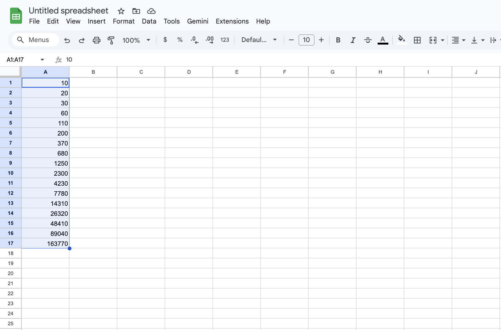
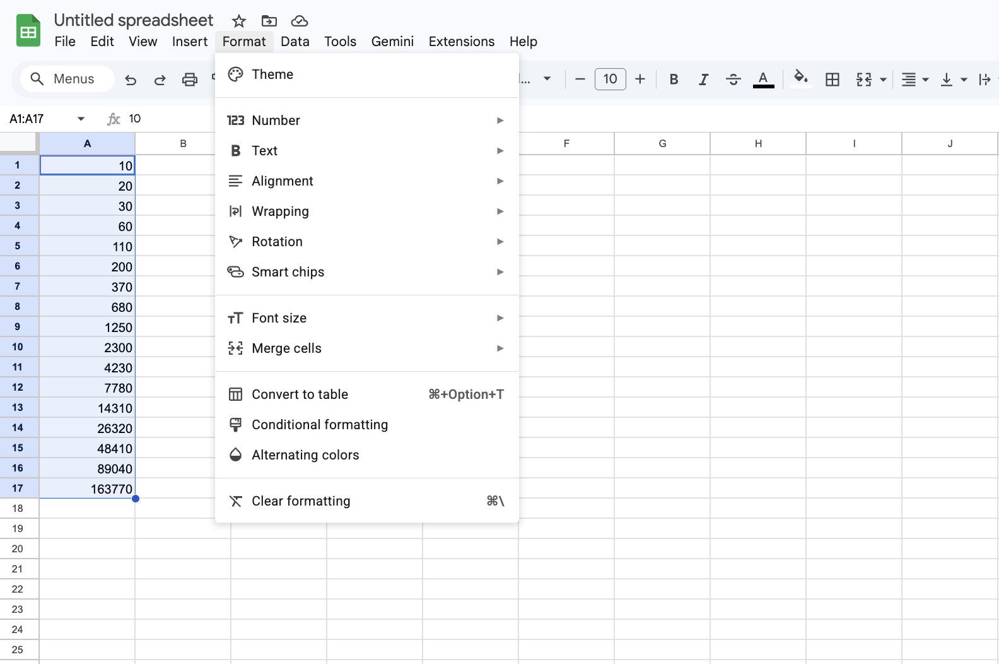
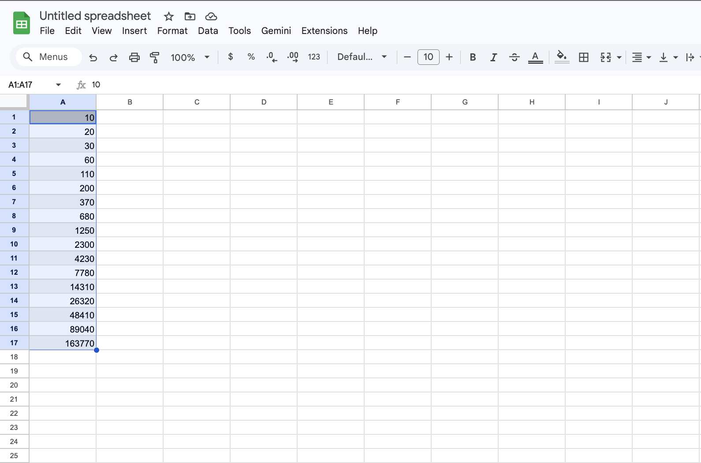
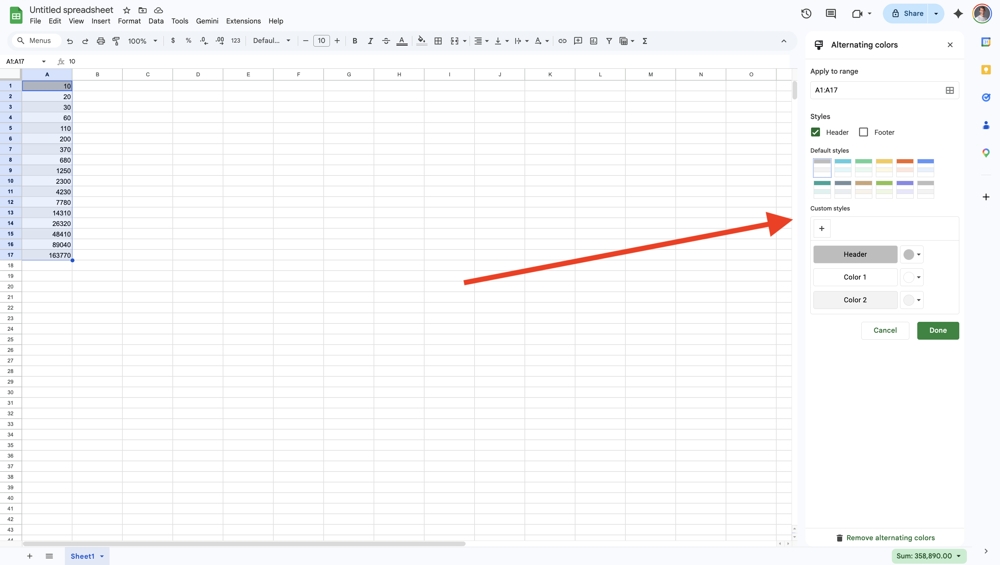
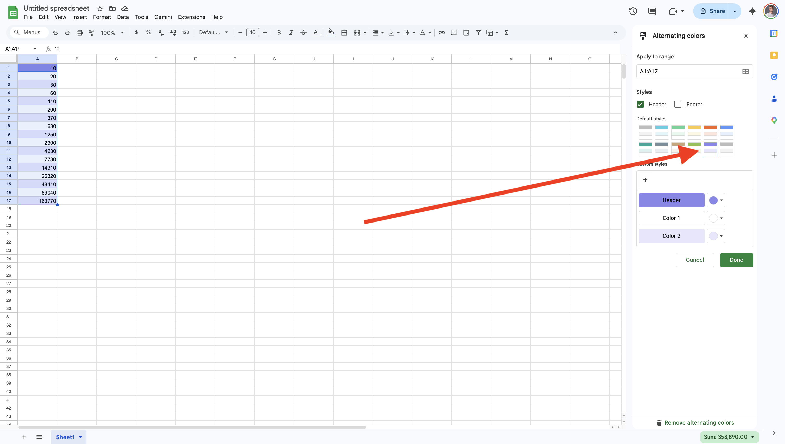
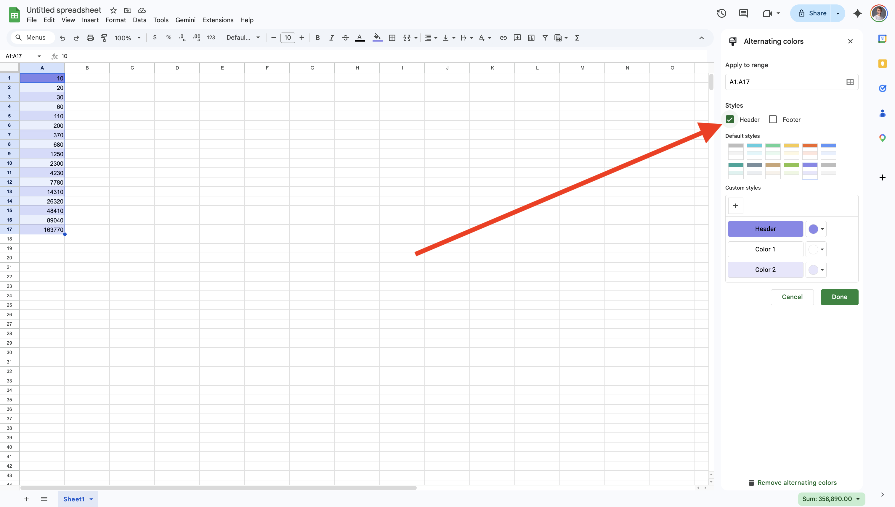
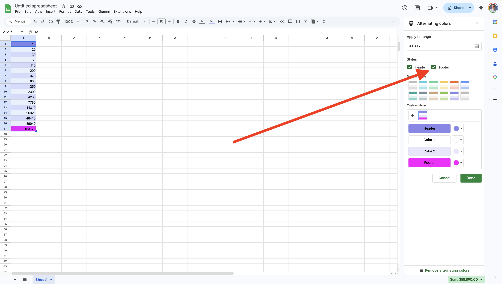
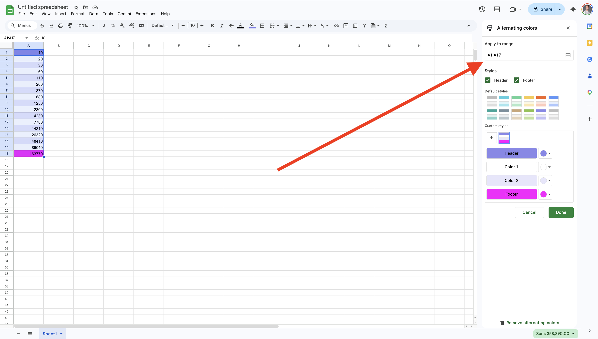
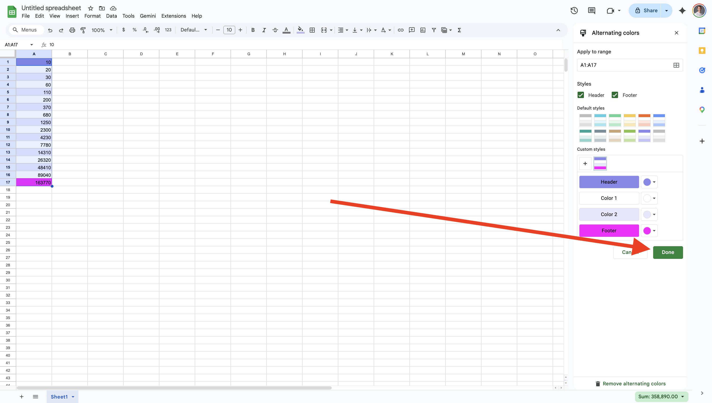

# Task 2: Alternating Row Colors (Banded Rows)

## Overview

When working with large datasets, it can be difficult for the eye to track a single row of information from left to right. **Alternating colors**, also known as "banded rows," apply different shades to every other row to improve readability and give your spreadsheet a professional, polished look.

This task is essential for data presentation. By using the built-in formatting tools, you ensure that even if you add more rows later, the styling remains consistent and clean.

## What is a Banded Row?

A banded row is a formatting style where the background color of even-numbered rows differs from odd-numbered rows. In Google Sheets, this is handled through the **Alternating colors** menu, which automates the shading process so you don't have to color cells manually.

## Example

Imagine a list of 50 employees and their phone numbers. Without banding, the white background makes the lines blend together. After applying **Alternating colors**:

- Row 1: Dark Blue (Header)
- Row 2: Light Blue
- Row 3: White
- Row 4: Light Blue

## Instructions

1. **Click and drag** your mouse to highlight the specific range of cells that contains your data.

    !!! warning "Select The Right Data"
        When applying alternating colors, Google Sheets shades **only the range you highlight**.  
        Make sure you select the exact rows you want to format before opening the menu.

2. Move your cursor to the top **Menu Bar**.
3. Click on the **Format** tab to open the dropdown menu.

4. Scroll down and select **Alternating colors**.

5. Observe the **Alternating colors** settings panel that appears on the right side of the screen.

6. Under the **Styles** section, click on a color preset (e.g., Blue, Green, or Grey) that matches your preference.

7. Check the box labeled **Header** if your top row contains titles or labels.

8. Check the box labeled **Footer** if you want the very last row to have a distinct summary color.

9. Review the "Apply to range" box at the top of the panel to ensure it covers your entire dataset.

10. Click the **Done** button at the bottom of the side panel to save your changes.

    !!! tip "Styles Update Automatically"
        If you add new rows inside your formatted range, Google Sheets will **extend the alternating colors automatically**.  
        You don’t need to reapply the style.

## Conclusion

By applying alternating row colors, you’ve taken an important step toward making your data easier to read and more visually organized. Banded rows help the eye follow information across wide spreadsheets and give your document a more professional appearance with almost no effort. Because Google Sheets updates the styling automatically as you add or remove rows, this formatting choice continues to work for you in the background. With this skill, you can present larger datasets more clearly and maintain a clean, consistent layout throughout your spreadsheet.
