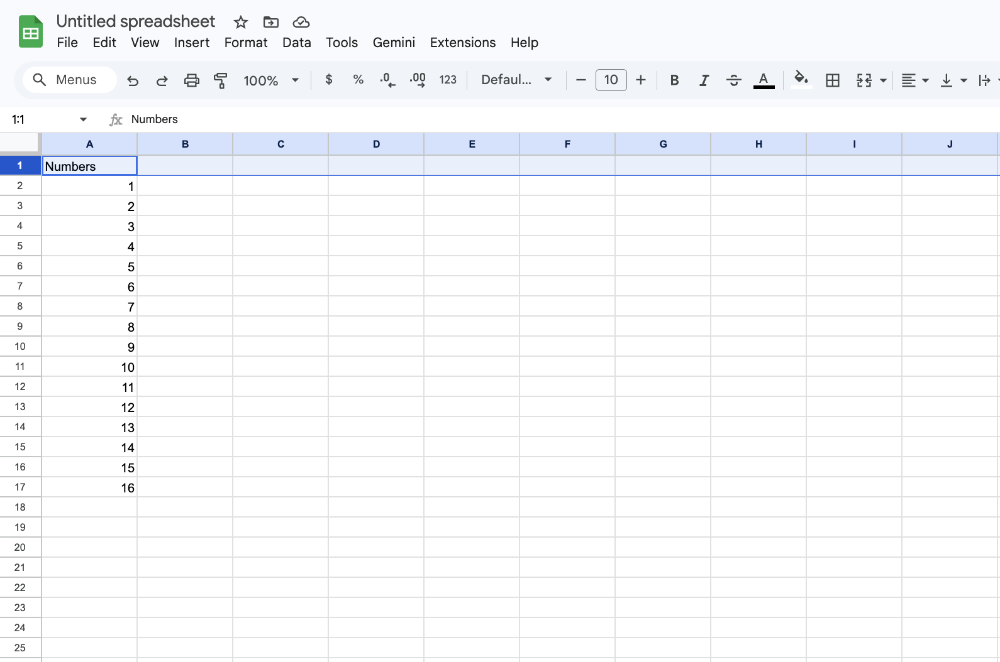
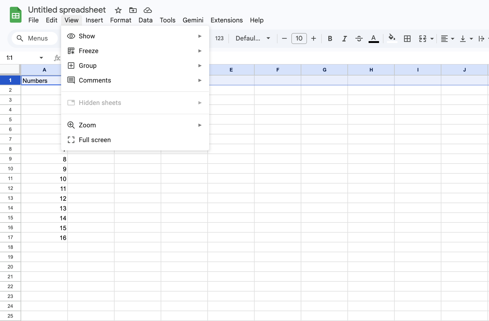
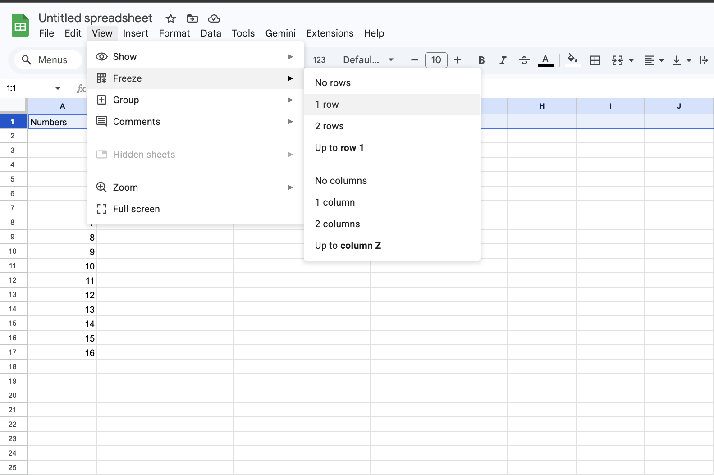
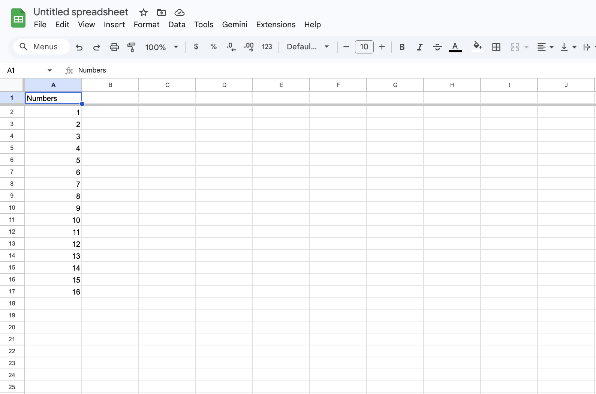
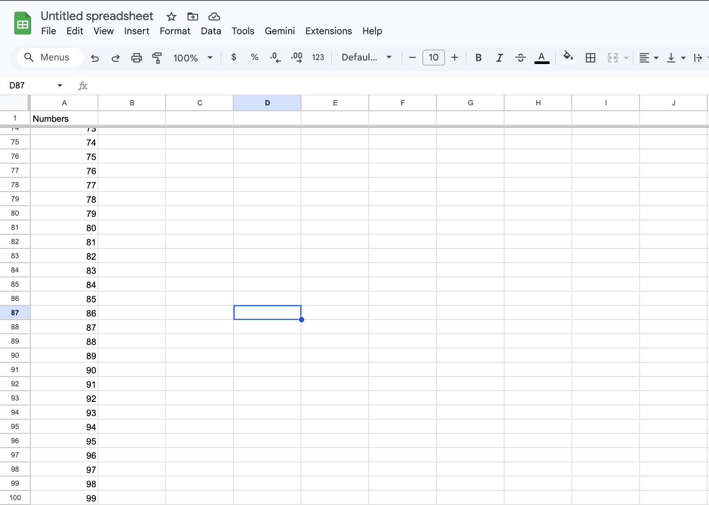
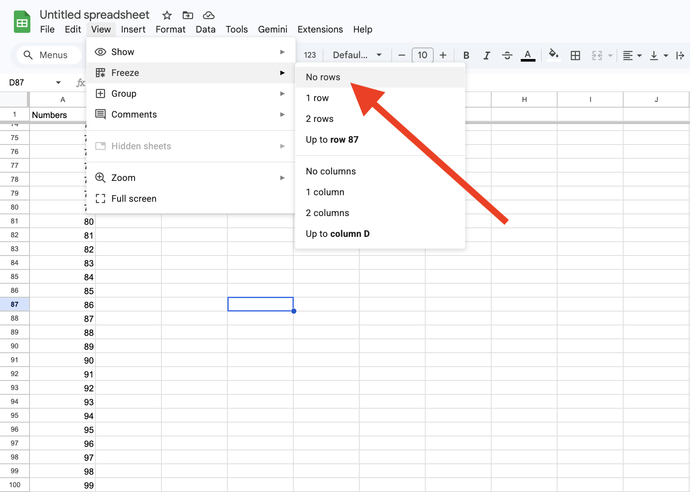

# Task 3: Freezing the Header Row

## Overview

As spreadsheets grow in length, the top row (which usually contains titles like "Date" or "Price") disappears as you scroll down. **Freezing** the header row locks it at the top of your screen, ensuring you always know exactly what data you are looking at, regardless of how far down you scroll.

## What is "Freezing"?

Freezing a row acts like a physical pin; it holds a specific section of the spreadsheet in place while the rest of the grid remains scrollable. This is a "view-only" change, meaning it doesn't affect how the sheet prints or how formulas work—it only changes how you see the data.

!!! tip "Data's Safety"
    Freezing rows affects only your view.  
    It does not change formulas, sorting, printing, or the actual content of your sheet.

## Example

If you have a list of 200 grocery items, by the time you reach item #150, you might forget if Column C is "Unit Price" or "Total Cost." By **Freezing Row 1**, the titles stay visible at the top of your browser window at all times.

## Instructions

1. Move your mouse to the far left of the screen and **click the number 1** to highlight the entire first row.

2. Move your cursor to the top **Menu Bar**.
3. Click on the **View** tab.

4. Hover your mouse over the first option, **Freeze**.
5. In the side menu that appears, click on **1 row**.

6. Look closely at the line between Row 1 and Row 2; you will notice a **thick grey divider line** has appeared.

    !!! tip "What the Grey Line Means"
        The grey divider indicates the frozen section.  
        Everything above the line stays visible while you scroll.

7. Click on any empty cell in the middle of your sheet to deselect the row.
8. Use your mouse wheel or trackpad to **scroll down** toward Row 50 or 100.

9. Observe that **Row 1 stays fixed** at the top of the screen while the other numbers scroll underneath it.
10. To unlock the row later, navigate back to **View** > **Freeze** > **No rows**.

    !!! tip "Unfreezing is Safe"
        Choosing No rows simply removes the frozen view.  
        Your data, formatting, and formulas remain untouched.

## Conclusion

Freezing the header row ensures that your column titles stay visible no matter how far you scroll, making long spreadsheets significantly easier to navigate. This simple viewing adjustment keeps your place in the data and reduces mistakes caused by losing track of what each column represents. Because freezing affects only how the sheet appears on your screen, and not the data itself, you can turn it on or off at any time without risk. With this skill, you can work confidently in larger datasets while keeping important context in view.
