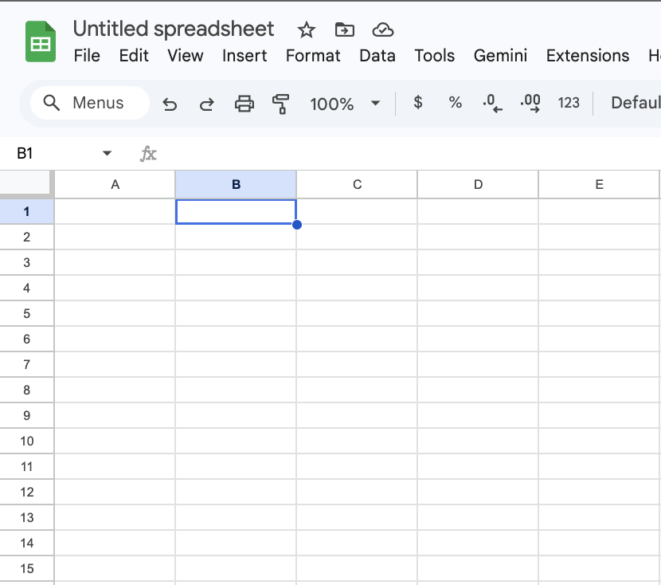
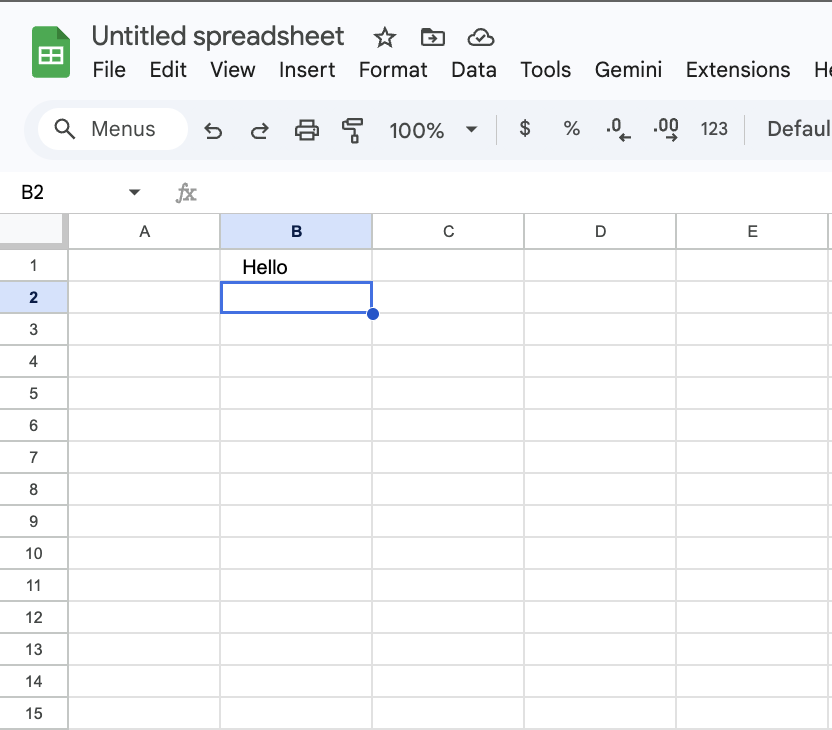
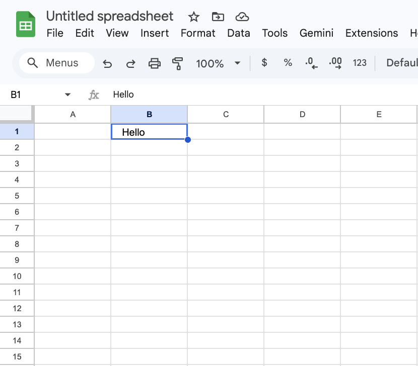
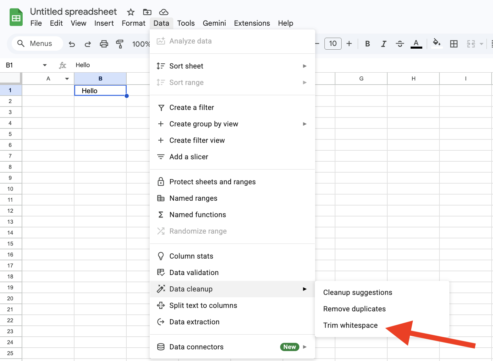
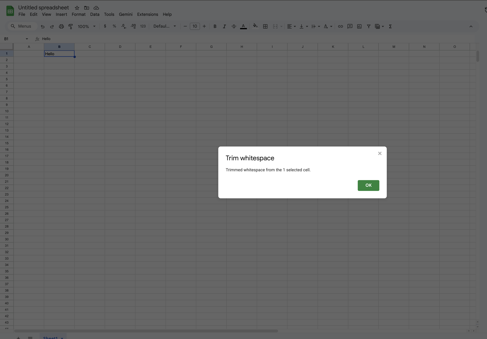

# Task 4: Cleaning Data with "Trim Whitespace"

## Overview

Data imported from websites or other documents often contains "hidden" spaces at the beginning or end of text. These invisible characters can cause formulas to fail and make your sorting look messy. The **Trim whitespace** tool scans your text and instantly deletes these unnecessary spaces.

## What is Whitespace?

In computing, "whitespace" refers to any character that represents horizontal or vertical space (like hitting the spacebar or the tab key). While invisible, Google Sheets treats "Apple" and " Apple " (with a space) as two completely different pieces of data. Trimming ensures your data is uniform and "clean."

!!! tip "Whitespace Is Invisible"
    Extra spaces are hard to spot with your eyes, but Google Sheets treats them as real characters.  
    Trimming helps ensure your data behaves consistently in formulas and sorting.

## Example

- **Original Data:**  `$150.00`
- **After Trim:** `$150.00`
The extra gaps are removed, but the space *between* words (like "John Smith") is preserved.

!!! tip "Trim is Safe"
    The Trim whitespace tool only removes **leading and trailing spaces**.  
    It will not delete the space between first and last names or between normal words.

## Instructions

1. **Click on cell B1** to select it for this exercise.

2. Press the **Spacebar three times**, type the word `Hello`, and press the **Spacebar three more times**.
3. Press **Enter** to commit the text to the cell.

4. Click back on **cell B1**—notice how the text looks off-center because of the extra spaces.

5. Move your cursor to the top **Menu Bar**.
6. Click on the **Data** tab.
7. Hover your mouse over the **Data cleanup** option.
8. Select **Trim whitespace** from the sub-menu.

9. Wait for the **pop-up notification** to appear, telling you how many cells were cleaned.

10. Click **OK** on the notification to return to your perfectly formatted cell.

    !!! tip "Trim Helps Fix Sorting Problems"
        If your data refuses to sort correctly, hidden spaces are often the cause.  
        Running **Trim whitespace** is a quick way to fix unexpected sorting behavior.
